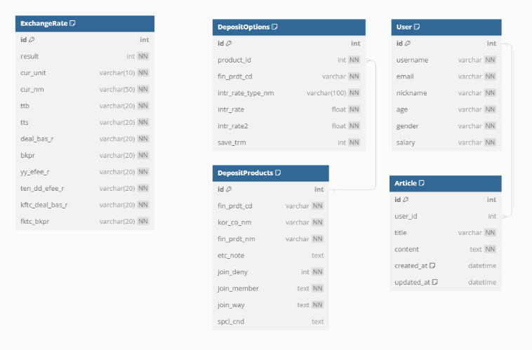

### 팀원 정보 및 업무 분담 내역   
팀장. 곽대건: 게시판, 회원가입, 로그인 구현, 지점 찾기, 상품 추천 구현   
팀원1. 남은식: 홈페이지, 환율 계산기, 전체적인 CSS 구현   
팀원2. 박준수: 예/적금 비교, 가입한 상품 구현, 상품 추천 구현   
---

### 💡개요   
진행기간 : 2024.05.16(목) ~ 2023.05.24(금)   
주제 : 원하는 예적금 상품 비교 및 추천 사이트   
서비스명 : 슈퍼 이끌림   
🐽서비스 소개   
혹시 돈이 이끌리고 싶으신가요? 저희는 '슈퍼 이끌림'이라는 웹페이지를 통해   예적금 상품 비교 및 가까운 은행 찾기, 환율 정보제공, 각자 상황에 맞는 예적금 상품 추천 서비스를 제공합니다.   
---

### 🦾주요 기능   
- 메인페이지   
사이트 첫 화면. 주요 기능에 대한 링크와 간략한 안내를 포함.   
클릭하면 주요 은행사이트로 연결되는 캐러셀 제공.   
페이지 하단에는 최신동향 뉴스를 제공하며 사용자에게 다양한 정보를 제공.   

- 예적금 금리 비교.   
예금과 적금을 나누었고 은행별로 검색이 가능한 서비스.   
상세버튼을 누르면 단리인지 복리인지 그리고 최고로 받을 수 있는 금리와 금액을 입력하면 모을 수 있는 금액을 제공.   
하단에 가입하기 버튼을 누르면 마이프로필에 가입한 상품들이 저장됨.   

- 환율계산기.   
각 나라 별로, 사용자가 현재 환율 정보를 조회하고 환율 계산을 할 수 있도록 도움.   

- 지점 찾기.   
시/도 선택, 구/군 선택, 은행 선택 버튼을 만족하여 검색하면 요구 조건에 맞는 은행위치 제공.   

- 나에게 맞는 상품 추천.   
맞춤 금융 상품 추천으로 선호하는 은행, 최소 금리, 가입 방식, 상품 유형을 토대로 요구 조건에 만족하는 상품을 추천해주는 서비스.   

- 커뮤니티.   
게시판을 통해 각 유저들이 소통할 수 있는 공간을 마련.   
서로 질문을 통해 정보 공유 가능.   

- 마이프로필.   
나의 회원정보를 알 수 있고, 가입한 금융 상품을 보여주고, 상품별로 저축 금리와 최고 우대 금리를 그래프로 제공하여 한눈에 쉽게 비교가 가능하고, 취소하고 싶은 상품을 취소할 수 있음.   
또한 프로필을 새롭게 수정할 수 있고, 슈퍼 이끌림이 필요가 없어진다면 회원탈퇴 또한 가능.   
---

### 데이터베이스 모델링(ERD)   

---

### 금융 상품 추천 알고리즘에 대한 기술적 설명   
사용자가 선호하는 은행과 "적어도 이 정도 금리는 됐으면 좋겠다" 하는 최소 금리, 영업점이나 스마트폰, 인터넷 등 상황에 맞는 가입방법, 적금인지 예금인지 필터링하도록 구현하였습니다.   상품 전체 리스트를 장고서버로 axios 구문을 이용하여 요청한 후 api서버를 통해 데이터를 받아온 후 변수에 데이터의 밸류를 저장하였습니다. includes 내장함수를 통해 적금과 예금으로 나누고 각 항목별로 ref 변수에 담은 후 선택하면 그 항목에 만족하는 상품만 노출되게 하는 원리입니다.
---

### 🎡작업   
저희 조는 세명이다 보니 프론트엔드와 백엔드를 구분하지 않고 각자 요구사항에 맞는 기능들을 분담하려 했습니다.   또한 첫 프로젝트이다 보니 하나를 정해서 하는 것 보다 백에서 프론트로 이어지는 전체적인 흐름을 이해하려고 했습니다. 어려웠던 부분들은 공식문서나 강의자료를 보며 구현하려 노력했으며, 그래도 모르겠는 점은 AI를 이용하여 로직을 이해하고 적었습니다.

- 5월 16일(목)   
업무 분담 및 메인 페이지 피그마 구현   
사이트 전체 기획 및 ERD 작성   
컴포넌트의 구조틀 생성   
django models 구축   
개선해야 할 점과 앞으로 구현할 계획 작성   

- 5월 17일(금)   
예/적금 비교에서 DB에 저장하기 위한 모델과 시리얼라이저 구축   
카카오뱅크 api를 받아와서 Bankfind.vue 페이지 생성(미완). 카카오뱅크 개발자 페이지 문서를 참고하여   
각종 기능들을 구현 (마커초기화, 검색)   
환율 api 받아서 ExchangeRatioCalc.vue 페이지 생성 후 구현 중..   

- 5월 18일(토)   
예/적금 비교할 시 api 요청을 하는데 token 에러가 나서 해결..   
지점 찾기 개발 중 시/도와 구/군, 은행을 드롭다운으로 선택해서 검색하고 싶은데 드롭다운으로 하려면 전국의 시도구군, 은행을 찾아와야 해서 AI를 이용하여 리스트에 넣고, selected 변수를 만들어 선택한 항목을 저장하도록 로직 구성.   
환율 계산기 개발 중 단방향으로만 환율이 바뀌는 것을 알아채고 양방향으로 환율이 바뀔 수 있도록 조정.   

- 5월 19일(일)   
예적금 상품 조회: 금융상품 중 예금과 적금으로 데이터를 키워드화 해서 products에 저장.   
그 후 routerLink를 통해 예금 조회, 적금 조회 페이지 두개로 나눔.   
회원가입 로그인 로직을 django-rest-auth를 이용하여 기본적인 구현 완료. (django-rest-auth 자료 참고)   
홈페이지에 각 은행별 이미지를 넣어 캐러셀을 만들어 이미지를 누르면 은행별 홈페이지로 이동할 수 있게 구현   
게시물 생성, 수정, 삭제를 할 수 있는 로직을 구현. 게시물이 수정이 새로고침을 해야지만 되는 어려움이 있었으나 수정 후 바로 남아있는 게시물의 데이터를 받아오는 함수를 만들어 페이지가 새로고침 안되어도 게시물이 수정됨.   

- 5월 20일(월)   
프로필 수정과 삭제는 django-rest-auth에서 제공하지 않는 기능이란걸 알고, accounts 앱에 views함수를 만들어 put요청, delete요청에 맞는 url요청.   
예/적금 비교시 표를 만들어 금리와 우대조건을 나타나도록 구현, 오른쪽에 상세 버튼을 누르면 개월 별로 금리가 나오고 금액을 입력하면 최고금리에 맞춰서 금액 x 금리가 계산된 로직을 구현.   
맞춤 상품 추천 서비스 페이지 만들고 어떤알고리즘을 사용할 지 구체화, 항목별로 드롭다운으로 고르고 검색을 하면 그 항목에 맞춰진 상품들이 나열.   

- 5월 21일(화)   
상품 상세 페이지에서 로그인 한 사용자만 가입하기 버튼이 있어, 가입 버튼을 누르면 프로필페이지내에 보일 수 있도록 구현.   
추천 알고리즘 구현 중 프로덕트에 데이터가 키워드로 받아와져서 적금이나 예금 둘 중 하나로만 저장된다는 것을 알고, getallproducts 라는 함수를 만들어 모든 데이터를 get 방식으로 조회할 수 있도록 구현.   

- 5월 22일(수)   
각 페이지 CSS 스타일 바꾸기. 하늘색 계열으로 시원한 느낌을 주려고 함.   
페이지 하단(케러셀 밑 부분)에 뉴스 api를 받아와 카드섹션으로 최신 뉴스를 볼 수 있게끔 구현.   
전체적인 버그들을 수정.   

5월 23일(목)   
전체적인 CSS 다듬기   
프로필 페이지에서 바 그래프 구현할때 chart.js vue-chartjs vuetify 를 다운하여 구현하려 했으나 다운하고 등록을 하지 않아 어려움 발생. vuetify를 다운만 받는 것이 아닌 src 폴더 안에 plugins 폴더를 만들어 vuetify.js 파일을 만들어 로직을 저장해야지 그래프가 나타났음.   
저축금리와 최고금리 값을 뽑아 낼 때, 데이터의 구조를 몰라서 다량의 console.log를 찍으며 구조를 파악후 map함수로 각 차트데이터에 담아줌.   
---

### 느낀점과 후기   
- 곽대건😊   
돌이켜보니 훅훅 지나간 4개월인데 그 동안 배웠던 것들을 스스로 페이지를 만들어 구현하려고 하니 막막하고 답답했습니다. 하지만 둘보단 나은 셋이라고 셋이서 머리를 맞대고 매일 계획하고 구현하고 피드백까지 하면서 서로 서로 도움이 많이 되었습니다.   어려운 기능을 구현하려 할때 페이지의 Console 창이 붉은색으로 물들었을때 마다 포기하고 싶었지만, 다른 교육생들과 강사님에게 물어 물어 그 문제점을 해결하고 그 기능들이 온전히 작동했을 때는 단전에서 끌어오르는 성취감이 느껴졌습니다. 

- 남은식🙂   
프로그래밍 언어를 처음 배우고 난 후, 협업과 소통을 통해 프로젝트를 진행하는 경험에 대해 상상할 수조차 없었습니다. 첫 프로젝트로 인해 이제는 더 많은 것을 배우고 새로운 정보를 습득해야만 해야한다는 것을 많이 느꼈습니다.   이해하기 어려운 내용을 거부하려 했지만, 친절한 조원들의 도움으로 많은 것을 이겨냈습니다. 밤을 새우며 작성한 코드가 제대로 동작할지 걱정하고 두려워했지만, 그 결과가 나타나면서 자신감을 얻게 되었습니다. 이번 경험을 토대로 다음 프로젝트에서는 더 나은 성과를 내고 싶습니다.

- 박준수😲   
전반적으로 올 한 학기 동안 배웠던것을 모두 아우를 수 있는 기회였다고 생각했습니다. 처음에는 이런걸 왜 배우나 싶었는데 마지막 관통 프로젝트를 진행하면서 뼈저리게 느꼈습니다. 특히 axios를 통한 비동기 통신을 익힐 수 있는 좋은 기회였습니다.   뿐만 아니라 잊혀져 가던 CSS 문법또한 익히면서 class 이름을 선언할 때 신중해야함을 느꼈고, inline 선언문은 꼭 최후에 써야함을 알게 됐다.

